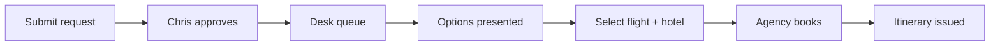
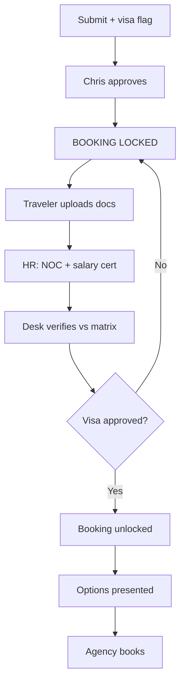
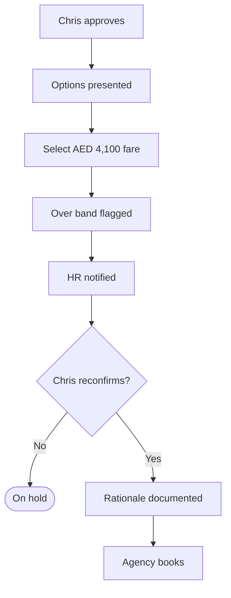
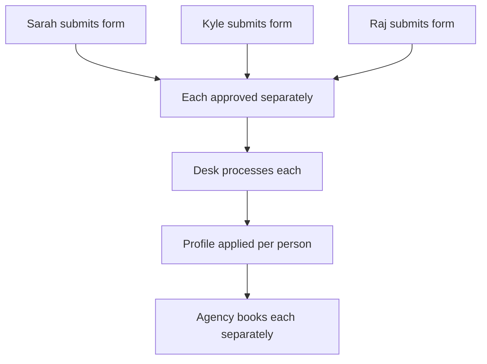

# Venture Plus × Specialist Services
## Corporate Travel Management Platform — Scope & Workflow Document

**Client:** Specialist Services  
**Travel execution partner:** Venture Plus  
**Final approver:** Chris Ridley (President)  
**Program owner:** HR / Melissa Payumo (governance and oversight)

---

## 1. Purpose

This document defines what the corporate travel platform covers, how travel moves through the system, what is required, which scenarios it must handle, what stays outside the platform, and what remains undecided.

**Central principle:** The platform manages the workflow, visibility, and governance. A licensed travel agency — operated through Venture Plus's travel desk — executes actual flight and hotel bookings in their own systems.

---

## 2. What Is in the System

The platform is a **travel management and workflow layer**. It is not a booking engine.

### 2.1 Core capabilities

| Area | What the system does |
|------|----------------------|
| **Travel requests** | Employees submit individual travel forms with full trip details |
| **Approvals** | Requests route through the approval hierarchy and require Chris's final sign-off before any booking activity |
| **Travel desk queue** | Venture Plus receives approved requests automatically |
| **Structured options** | Flights, hotels, and cars are presented as clear, comparable cards — not email screenshots |
| **Traveler profiles** | Passport, seat, meal, loyalty numbers, and class eligibility are stored once and applied on every trip |
| **Policy enforcement** | Regional cost bands are checked; over-band bookings are flagged and escalated |
| **Visa management** | Visa requirement blocks all booking until documents are complete and visa is approved |
| **Selection & confirmation** | Employee or desk selects an option; system records confirmation and generates itinerary |
| **Documents** | Trip-named tickets and vouchers (e.g. `Sarah Ahmed – Amsterdam – Sep 2026 – KLM Ticket`) |
| **Notifications** | Traveler, HR, and desk are notified at key stages; HR is copied without needing to coordinate manually |
| **Governance views** | HR monitors compliance, visa status, band breaches, and profile accuracy |
| **Management reporting** | Spend by traveler, destination, and region; over-band incident tracking |
| **Traveler safety tracker** | Live view of who is outside the UAE, where they are, and when they return |
| **Audit trail** | Full record of request, approval, selection, booking, and exceptions |

### 2.2 User roles

| Role | Primary use of the system |
|------|---------------------------|
| **Employee** | Submit requests, upload visa documents, review options, view itinerary |
| **Manager** | Acknowledge or approve at department level (if required) |
| **Chris (President)** | Final approval; reconfirm over-band exceptions |
| **Venture Plus travel desk** | Receive approved requests, source options, publish to portal, confirm bookings |
| **HR (Melissa)** | Governance — visa oversight, band breaches, profile management, safety tracking |
| **Management** | Spend visibility and traveler location for duty-of-care |

### 2.3 Travel request form fields

Each request is **individual per traveler** — no combined group forms.

| Field | Description |
|-------|-------------|
| Traveler name | Person traveling |
| Department | Employee's department |
| Department head | Reporting manager |
| Purpose of travel | Reason for the trip |
| Project number / client name | For cost allocation and re-invoicing |
| Origin and destination | Travel route |
| Departure date + preferred timing | e.g. late afternoon / early evening |
| Return date + preferred timing | e.g. afternoon for full client day |
| Hotel requirement | Yes / No |
| Preferred hotel location | Area or property preference |
| Check-in / check-out dates | Hotel dates |
| Car / transport requirement | Yes / No, with pickup/return details |
| Onward / additional travel | Multi-leg or extended itinerary |
| Visa declaration | Whether visa is required |
| Urgent flag | Time-sensitive travel marker |
| GL code | Optional — finance ownership still TBD |

### 2.4 Traveler profile fields

Maintained once per person, used on every booking:

| Field | Purpose |
|-------|---------|
| Passport number, issue date, expiry | Pre-loaded for visa and ticketing |
| Nationality and date of birth | Visa and airline compliance |
| Loyalty / frequent-flyer numbers | Applied automatically to every booking |
| Travel class eligibility | Economy / Premium Economy / Business |
| Seat preference | Aisle / Window |
| Meal preference | Veg / Non-veg / Vegan etc. |
| Preferred airlines / hotels | Optional recurring preferences |

**Travel class rules:**

| Traveler tier | Class |
|---------------|-------|
| Chris (President) | Business |
| VP level + Kyle + Melissa | Premium Economy (where available) |
| All other employees | Economy |

### 2.5 Cost bands

Defined thresholds govern auto-processing. Bookings within band proceed. Bookings exceeding band are paused until Chris reconfirms.

**Flight ticket bands (AED):**

| Region | Threshold |
|--------|-----------|
| GCC | 3,000 |
| Europe | 5,000 |
| Asia | 3,500 |
| Rest of World | Case-by-case |

**Hotel nightly bands (AED):**

| Region | Threshold |
|--------|-----------|
| GCC | 600 |
| Europe | 900 |
| Asia | 450 |
| Rest of World | Case-by-case |

### 2.6 Hard business rules enforced in the system

| Rule | Description |
|------|-------------|
| No pre-approval booking | Nothing is booked until Chris approves |
| Visa hard gate | If visa is required: no ticket and no booking work until visa is fully secured |
| One form per traveler | Each person's movement is independently traceable |
| Approved form = source of truth | Travel desk does not deviate from approved instructions |
| Over-band pause | Fares or hotels exceeding regional threshold require Chris reconfirmation with documented rationale |
| Car on form only | Car rentals must be declared on the travel request form at submission |

---

## 3. Workflow

### 3.1 Master end-to-end flow

```mermaid
flowchart TD
    START([Employee needs to travel]) --> FORM[Submit individual travel request]
    FORM --> MGR{Manager approval}
    MGR -->|Rejected| REJ([Request rejected])
    MGR -->|Approved| CHRIS{Chris final approval}
    CHRIS -->|Rejected| REJ
    CHRIS -->|Approved| NOTIFY[Notify Venture Plus desk + HR<br/>travel@specserve.com]

    NOTIFY --> VISA{Visa required?}

    VISA -->|Yes| VLOCK[BOOKING LOCKED]
    VLOCK --> VCHECK[Traveler: Travel Hub checklist + upload docs]
    VCHECK --> VHR[HR: NOC + salary certificate]
    VHR --> VDESK[Venture Plus: verify docs vs visa matrix]
    VDESK --> VSTATUS{Visa approved?}
    VSTATUS -->|No| VLOCK
    VSTATUS -->|Yes| UNLOCK[Booking unlocked]

    VISA -->|No| UNLOCK

    UNLOCK --> DESK[Travel desk picks up request]
    DESK --> PROFILE[Load traveler profile]
    PROFILE --> SEARCH[Agency searches inventory — outside platform]
    SEARCH --> OPTIONS[Desk publishes structured options in portal]

    OPTIONS --> SELECT[Employee or desk selects option]
    SELECT --> BAND{Within cost band?}

    BAND -->|No| FLAG[Flag over-band to HR]
    FLAG --> RECONFIRM{Chris reconfirms?}
    RECONFIRM -->|No| HOLD([Booking on hold])
    RECONFIRM -->|Yes| BOOK
    BAND -->|Yes| BOOK

    BOOK[Agency executes booking — outside platform]
    BOOK --> PREFS[Apply preferences: seat, meal, loyalty]
    PREFS --> CONFIRM[Portal: confirmed + documents attached]
    CONFIRM --> ITIN[Trip-named itinerary issued]
    ITIN --> NOTIFY2[Notify traveler + HR]
    NOTIFY2 --> DASH[Update dashboards + traveler tracker]
    DASH --> END([Complete])
```



### 3.2 Who does what — portal, desk, and agency

```mermaid
flowchart LR
    subgraph PORTAL["PORTAL — We build"]
        direction TB
        P1[Travel request form]
        P2[Approval workflow]
        P3[Travel desk queue]
        P4[Traveler profiles]
        P5[Structured options display]
        P6[Selection and policy checks]
        P7[Itinerary and documents]
        P8[Dashboards and audit trail]
        P1 --> P2 --> P3 --> P5 --> P6 --> P7 --> P8
        P4 -.->|auto-fill| P1
        P4 -.->|auto-apply| P7
    end

    subgraph DESK["TRAVEL DESK — Venture Plus"]
        direction TB
        D1[Review approved request]
        D2[Advise on best option]
        D3[Publish options to portal]
        D4[Confirm booking intent]
        D5[Upload tickets and vouchers]
        D1 --> D2 --> D3 --> D4 --> D5
    end

    subgraph AGENCY["AGENCY VENDOR — External"]
        direction TB
        A1[Search GDS / agency platform]
        A2[Access corporate rates]
        A3[Issue tickets]
        A4[Book hotels and vouchers]
        A5[Pay suppliers on credit terms]
        A1 --> A2 --> A3 --> A4 --> A5
    end

    P3 -->|approved request| D1
    D3 -->|options| P5
    P6 -->|selected option| D4
    D4 -->|book| A1
    A3 & A4 -->|tickets/vouchers| D5
    D5 -->|attach| P7
```



### 3.3 Responsibility matrix

| Activity | Portal | Travel desk | Agency |
|----------|:------:|:-----------:|:------:|
| Submit travel request | ✅ | | |
| Approve travel | ✅ | | |
| Maintain traveler profile | ✅ | | |
| Enforce cost bands and visa gate | ✅ | | |
| Search real inventory | | ✅ | ✅ |
| Present structured options | ✅ | ✅ | |
| Advise on best overall option | | ✅ | |
| Select preferred option | ✅ | ✅ | |
| Issue ticket / hotel voucher | | ✅ | ✅ |
| Pay airline / hotel | | | ✅ |
| Apply seat, meal, loyalty preferences | ✅ | ✅ | ✅ |
| Show itinerary to traveler | ✅ | | |
| Spend dashboard / safety tracker | ✅ | | |
| Audit trail | ✅ | | |

### 3.4 Three-layer architecture

```
┌─────────────────────────────────────────────────────────────┐
│  LAYER 1: PORTAL                                            │
│  Request → Approval → Options → Selection → Itinerary         │
│  Profiles | Cost bands | Visa gates | Dashboards | Audit      │
└────────────────────────────┬────────────────────────────────┘
                             │  Approved request + selected option
                             ▼
┌─────────────────────────────────────────────────────────────┐
│  LAYER 2: TRAVEL DESK (Venture Plus)                        │
│  Review → Advise → Publish options → Confirm → Upload docs  │
└────────────────────────────┬────────────────────────────────┘
                             │  Books in agency system
                             ▼
┌─────────────────────────────────────────────────────────────┐
│  LAYER 3: AGENCY VENDOR                                     │
│  GDS, inventory, ticketing, vouchers, rates, payments       │
└─────────────────────────────────────────────────────────────┘
```

### 3.5 How booking confirmation works

**In the platform:** Employee or desk selects an option. System checks policy (bands, visa, class). Status moves to confirmed. Itinerary and trip-named documents are generated. Dashboards update.

**Outside the platform:** Venture Plus desk instructs the agency to book the selected flight, hotel, or car in the agency's system. Agency issues the real ticket or voucher and pays the supplier on credit terms. Desk uploads the real documents back to the portal.

**Integration path:**

| Phase | How it works |
|-------|--------------|
| **v1 — Manual** | Desk searches agency system, enters options into portal, books after selection, uploads confirmation |
| **v2 — API (optional)** | Portal calls agency API for search and booking; confirmation syncs automatically |

---

## 4. Requirements

### 4.1 Functional requirements

| ID | Requirement | Priority |
|----|-------------|----------|
| FR-01 | Individual travel request form per traveler | Must have |
| FR-02 | Capture all form fields listed in Section 2.3 | Must have |
| FR-03 | Approval workflow ending with Chris — no booking before approval | Must have |
| FR-04 | Auto-notify Venture Plus desk and HR on approval | Must have |
| FR-05 | Traveler profile with passport, preferences, loyalty, class eligibility | Must have |
| FR-06 | Structured flight / hotel / car option presentation | Must have |
| FR-07 | Options matched to timing preferences and trip requirements | Must have |
| FR-08 | Consultant recommendation on best overall option (not price alone) | Must have |
| FR-09 | Auto-apply seat, meal, and loyalty from profile on booking | Must have |
| FR-10 | Regional cost band check on flights and hotels | Must have |
| FR-11 | Over-band flag with Chris reconfirmation and documented rationale | Must have |
| FR-12 | Visa hard gate — block all booking until visa approved | Must have |
| FR-13 | Travel Hub visa checklist and document upload tracking | Must have |
| FR-14 | HR NOC and salary certificate tracking for visa cases | Must have |
| FR-15 | Trip-named document delivery | Must have |
| FR-16 | Hotel payment / voucher status visible before travel | Must have |
| FR-17 | Complete itinerary view for traveler | Must have |
| FR-18 | HR governance view (not operational relay) | Must have |
| FR-19 | Spend dashboard by traveler, destination, region, band | Must have |
| FR-20 | Traveler safety tracker — who is outside UAE, where, return date | Must have |
| FR-21 | Audit trail for every trip | Must have |
| FR-22 | Travel class rules applied from profile | Must have |
| FR-23 | Car rental declared on form and booked as part of package | Must have |
| FR-24 | Urgent travel flag at submission | Should have |
| FR-25 | Multi-destination / multi-leg on single form | Should have |
| FR-26 | Notification to travel@specserve.com | Should have |
| FR-27 | Corporate rate indicator on hotel / airline options | Should have |
| FR-28 | GL code field on request form | Could have — ownership TBD |

### 4.2 Non-functional requirements

| ID | Requirement |
|----|-------------|
| NF-01 | Web-based platform accessible on desktop and mobile browser |
| NF-02 | Role-based access per persona (employee, Chris, desk, HR, management) |
| NF-03 | Professional, corporate-grade user interface |
| NF-04 | Audit log retained for compliance |
| NF-05 | Traveler profile data stored securely |

### 4.3 Visa workflow requirements

When visa is declared on the travel request:

| Step | Owner | Action |
|------|-------|--------|
| 1 | Traveler | Declares visa requirement at form submission |
| 2 | Traveler | Downloads destination checklist from Travel Hub; gathers documents |
| 3 | Traveler | Submits visa form, passport copy, ID photo, invitation letter (if required) |
| 4 | HR | Issues NOC and salary certificate |
| 5 | Venture Plus desk | Verifies all documents against visa requirements matrix |
| 6 | Venture Plus desk | Submits visa application; advises on processing timeline |
| 7 | Venture Plus desk | Marks visa approved in system |
| 8 | System | Unlocks booking; desk proceeds with flight and hotel |

**Hard rule:** No ticket issued. No booking worked on. Until visa is fully secured.

### 4.4 Option presentation requirements

Flight and hotel options must be presented so a decision can be made quickly without reviewing emails or screenshots.

**Each flight option must show:**

- Airline and flight number
- Direct or connecting (with stop details)
- Departure and arrival times
- Total journey duration
- Price in AED
- Cost band status (within / over)
- Consultant recommendation flag (where applicable)
- Match to requested timing preference

**Decision factors beyond price:**

- Direct vs connecting
- Departure / arrival timing vs client meeting schedule
- Total travel time and employee productivity
- Hotel cost and location
- Baggage and inclusions
- Whether a cheaper fare excludes benefits or requires an extra hotel night

---

## 5. Scenarios

### Scenario 1 — Standard travel (no visa)

**Situation:** Employee travels to Europe for a client visit. No visa required.

**Example:** Sarah Ahmed — Dubai → Amsterdam — 12–15 Sep 2026 — Project #SS-2026-NL-04



| Step | Portal | Agency |
|------|--------|--------|
| Sarah submits form with timing and hotel preferences | Request created, pending approval | — |
| Chris approves | Desk and HR notified | — |
| Desk loads Sarah's profile (aisle, veg, economy) | Options published in portal | Searches flights and hotels |
| Sarah selects KLM direct + Crowne Plaza Utrecht | Band check passes (within Europe limits) | Books ticket and hotel |
| System confirms | Itinerary issued, preferences applied, HR notified | Pays hotel on credit terms |

**Flight options presented:**

| Option | Airline | Route | Depart | Price | Band |
|--------|---------|-------|--------|-------|------|
| Recommended | KLM | Direct | 16:45 | AED 4,200 | Within |
| B | Emirates | Direct | 14:20 | AED 4,650 | Within |
| C | Qatar Airways | 1 stop | 11:00 | AED 3,800 | Within |

---

### Scenario 2 — Visa-required travel

**Situation:** Traveler needs a visa. Booking is locked until visa is approved.

**Example:** Raj Patel — Dubai → Frankfurt — Indian passport



| Step | Portal | Agency |
|------|--------|--------|
| Raj submits with visa flag | Booking locked — visa pending | — |
| Chris approves travel request | Lock remains | — |
| Raj uploads documents; HR provides NOC | Checklist tracked in portal | — |
| Desk verifies and submits visa | Status updated | Visa application submitted |
| Visa approved | Booking unlocked | — |
| Desk presents options and books | Itinerary issued | Ticket and hotel booked |

---

### Scenario 3 — Over-band escalation

**Situation:** Selected fare exceeds regional cost band. Booking pauses until Chris reconfirms.

**Example:** Kyle Morrison — Dubai → Singapore — only direct option AED 4,100 (Asia band: AED 3,500)



| Step | Portal | Agency |
|------|--------|--------|
| Kyle selects over-band option | System flags and pauses booking | — |
| HR reviews with justification | Escalation sent to Chris | — |
| Chris reconfirms with reason | Rationale stored in audit trail | — |
| Desk proceeds | Booking confirmed | Books in agency system |

---

### Scenario 4 — Urgent / last-minute travel

**Situation:** Time-sensitive trip. Form still required; flagged urgent at submission.

| Step | Portal | Agency |
|------|--------|--------|
| Employee flags URGENT | Request moves to top of desk queue | — |
| Chris expedites approval | Priority notification to desk | — |
| Desk prioritizes search | Options published quickly | Immediate inventory search |
| If band cannot be met | Over-band escalation (Scenario 3) | Books best available |

Urgency affects queue priority and desk response. It does not bypass approval or policy rules.

---

### Scenario 5 — Executive travel (business class)

**Situation:** Travel class is applied automatically from the traveler profile.

**Example:** Chris Ridley — Dubai → London

| Step | Portal | Agency |
|------|--------|--------|
| Form submitted | Business class auto-applied from profile | — |
| Chris approves | Standard flow | — |
| Desk presents options | Business-class options only; aisle seat noted | Searches business inventory |
| Booking confirmed | Skywards number applied | Business ticket issued |

---

### Scenario 6 — Multi-destination travel

**Situation:** All legs declared on one form before submission. Processed as a single itinerary.

**Example:** Dubai → Amsterdam → Frankfurt → Dubai

| Step | Portal | Agency |
|------|--------|--------|
| Employee declares all legs | Multi-segment form captured | — |
| Chris approves entire itinerary | Single approved request | — |
| Desk processes | Options per leg; single itinerary view | Books all segments as one trip |

No back-and-forth to add segments after approval.

---

### Scenario 7 — Client inbound travel to UAE

**Situation:** Host department arranges travel for a visiting client or partner.

| Step | Portal | Agency |
|------|--------|--------|
| Host submits inbound form | Client name, arrival, hotel, car captured | — |
| Chris approves | Standard flow | — |
| Desk arranges | UAE hotel band applied; corporate rate if available | Books hotel and airport transfer |

---

### Scenario 8 — Group travel (individual forms)

**Situation:** Multiple people traveling. Each person submits their own form.

**Example:** Three salespeople traveling to Singapore — separate itineraries



Each traveler has an independent form, approval, and booking. If itineraries diverge later, no form becomes invalid.

---

### Scenario 9 — Hotel payment confirmation

**Situation:** Hotel payment must be confirmed before the traveler arrives at the property.

| Status in portal | Meaning |
|------------------|---------|
| Pending payment | Agency has initiated hotel booking |
| Voucher issued | Agency has confirmed booking with hotel |
| Confirmed / Paid | Payment cleared — safe to check in |

Prevents the situation where a traveler arrives with a valid voucher but the hotel has not been paid.

---

### Scenario summary

| # | Scenario | Visa gate | Band check | Agency books |
|---|----------|:---------:|:----------:|:------------:|
| 1 | Standard (no visa) | No | Yes | Yes |
| 2 | Visa required | Yes — hard lock | Yes | Yes (after visa) |
| 3 | Over-band escalation | No | Yes — blocks | Yes (after reconfirm) |
| 4 | Urgent / last-minute | Optional | Yes | Yes |
| 5 | Executive (business class) | No | Yes | Yes |
| 6 | Multi-destination | Optional | Per leg | Yes |
| 7 | Client inbound UAE | No | Yes | Yes |
| 8 | Group (individual forms) | Optional | Per person | Yes (each) |
| 9 | Hotel payment confirmation | No | Yes | Yes |

---

## 6. What Is Not in the System

The following are explicitly **out of scope** for the platform. They remain with the travel agency, finance, or other systems.

### 6.1 Booking and inventory

| Item | Who handles it |
|------|----------------|
| Real flight / hotel / car inventory search | Travel agency (GDS / agency platform) |
| Live pricing and seat availability | Travel agency |
| Ticket issuance | Licensed IATA travel agency |
| Hotel voucher generation | Travel agency |
| Payment to airlines, hotels, and suppliers | Travel agency on credit terms |
| Booking amendments and cancellations | Travel desk + agency |
| Direct GDS integration (Amadeus, Sabre, etc.) | Not planned — requires IATA licensing and large deposits |

### 6.2 Commercial and rate management

| Item | Who handles it |
|------|----------------|
| Corporate rate negotiation with airlines | Travel agency / Venture Plus partnership |
| Corporate hotel rate agreements (Marriott, etc.) | Travel agency |
| Airline business rewards registration | Travel agency |
| Hotel loyalty program management | Travel agency |
| Flight markup / agency fee structure | Commercial agreement between Venture Plus and client |

### 6.3 Finance and operations

| Item | Who handles it |
|------|----------------|
| Invoice generation and payment to agency | Finance department |
| Invoice reconciliation (matching invoices to travelers) | Finance department |
| GL code assignment on travel costs | Finance / HR — ownership TBD |
| Corporate card management for direct bookings | Finance department |
| Call-off PO / credit limit management with agency | Finance + Venture Plus |

### 6.4 Other systems

| Item | Notes |
|------|-------|
| Centurion approval system integration | Not in initial scope — platform may replace or run alongside |
| Email auto-extraction / inbox-to-ticket | Future phase |
| Full visa matrix for all countries and nationalities | Agency maintains matrix; platform shows checklist per destination |
| Self-service booking by employees (Booking.com / Marriott direct) | Not in scope — credit and governance constraints |

### 6.5 What the platform does not replace

| Responsibility | Notes |
|----------------|-------|
| Travel agency books flights and hotels | Agency still books — platform governs the process around it |
| Chris approves all travel | Unchanged — Chris retains approval authority |
| Agency holds IATA deposits and credit with airlines | Unchanged — agency responsibility |
| Finance pays agency invoices | Unchanged — finance responsibility |

---

## 7. Summary

| | |
|---|---|
| **What we build** | Travel management portal — request, approval, options, profiles, policy, itinerary, dashboards |
| **What the agency does** | Real inventory, ticketing, hotel vouchers, supplier payment, corporate rates |
| **What Venture Plus desk does** | Operates between portal and agency — advises, publishes options, confirms bookings |
| **What HR does** | Governs — does not coordinate every email and booking |
| **What Chris does** | Approves all travel; reconfirms over-band exceptions |
| **Core message** | One place for the full travel journey. Preferences stored once. Policy enforced. Agency books the travel. |

---

*Document version: 1.0 — Venture Plus × Specialist Services*
